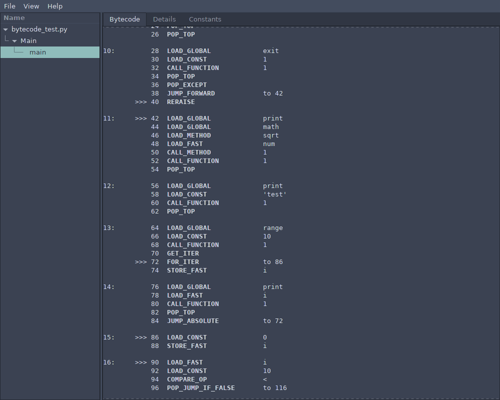

# pycDisGUI

GTK graphical user interface for Python bytecode disassembly using the [xdis](https://github.com/rocky/python-xdis/) disassembler library.

* Code Structure Tree
* Bytecode formatting with line numbers, offsets, and jump points
* Details tab with file and function information
* Constants tab

